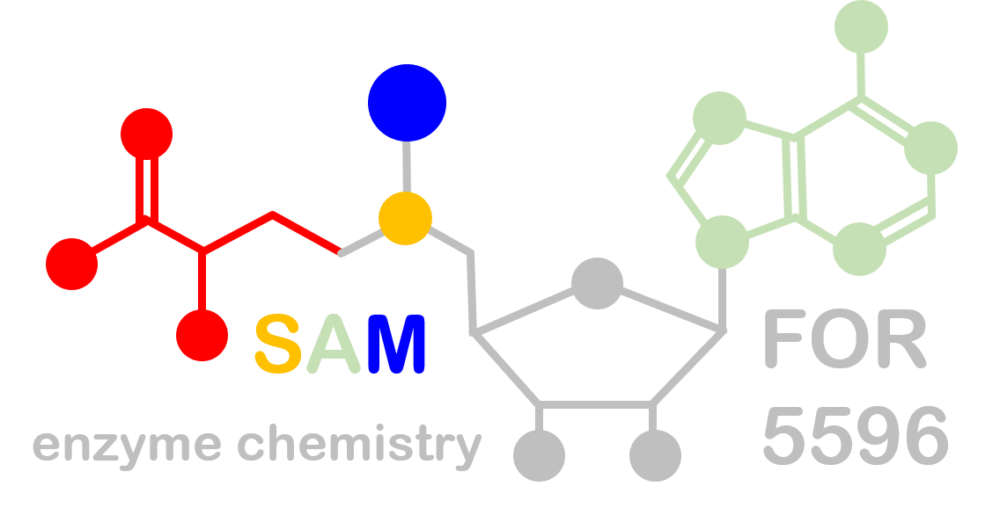

# Research Data Management in FOR5596

{{: style="height:159px;width:300px", align="left"}
Within FOR5596 state-of-the-art research data management is developed and implemented for all research projects. The underlying goal is to create highly annotated, structured data sets that are in line with [FAIR principles](https://www.go-fair.org/fair-principles/). This includes the use of standardized data models as well as the development of new data standards. Ultimately, this leads to high-quality data assets that are re-analyzable and reusable for future research projects.