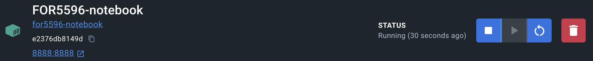

Jupyter Notebook is a web-based interactive computing environment that allows you to create and share documents that contain live code, equations, visualizations, and narrative text. It is a great tool for data analysis and visualization. In this Jupyter Notebook environment, sdRDM is already installed, allowing the usage of [RDM].
  [RDM]: ../rdm/define.md#define-a-rdm

1. Install [Docker]
  [Docker]: docker.md#docker


2. Run the FOR5596 Jupyter Lab Docker container from a command line

    ```bash
    docker run -it --rm -p 8888:8888 -v "${PWD}":/home/jovyan/work --name FOR5596-notebook for5596-notebook
    ```

3. Open the Docker Desktop application navigate to `Containers` and click on the running container named `FOR5596-notebook`

4. within the `Logs` of the container, you will find a token, which is needed to access the Jupyter Notebook. 

    ```bash
    2024-02-25 17:44:54 [I 2024-02-25 16:44:54.937 ServerApp]     http://127.0.0.1:8888/lab token=a9a39e2f219edac28f66cf2c88a9954978f78626e58e03f6
    2024-02-25 17:44:54 [I 2024-02-25 16:44:54.937 ServerApp] Use Control-C to stop this server and shut down all kernels (twice to skip confirmation).
    2024-02-25 17:44:54 [C 2024-02-25 16:44:54.939 ServerApp] 
    2024-02-25 17:44:54     
    2024-02-25 17:44:54     To access the server, open this file in a browser:
    2024-02-25 17:44:54         file:///home/jovyan/.local/share/jupyter/runtime/jpserver-7-open.html
    2024-02-25 17:44:54     Or copy and paste one of these URLs:
    2024-02-25 17:44:54         http://e2376db8149d:8888/lab?token=a9a39e2f219edac28f66cf2c88a9954978f78626e58e03f6
    2024-02-25 17:44:54         http://127.0.0.1:8888/lab?token=a9a39e2f219edac28f66cf2c88a9954978f78626e58e03f6
    2024-02-25 17:44:55 [I 2024-02-25 16:44:55.984 ServerApp] Skipped non-installed server(s): bash-language-server, dockerfile-language-server-nodejs, javascript-typescript-langserver, jedi-language-server, julia-language-server, pyright, python-language-server, python-lsp-server, r-languageserver, sql-language-server, texlab, typescript-language-server, unified-language-server, vscode-css-languageserver-bin, vscode-html-languageserver-bin, vscode-json-languageserver-bin, yaml-language-server
    ```

    In the example above, the token is `a9a39e2f219edac28f66cf2c88a9954978f78626e58e03f6`.

5. Click on the link `8888:8888` in the header of the container to open the Jupyter Notebook in your default web browser.

    

6. Enter the token from the logs in the field `Token` and click on `Log in`.

7. You are now in the Jupyter Notebook environment your local files can be accessed via the `work` folder.