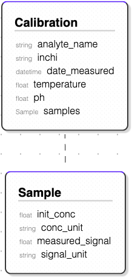

# Define a RDM


???+ Abstract "Background on structured data"
    Defining the structure of data is the prerequisite for structured data. This is traditionally done by writing a schema in JSON or XML, which defines a format. Additionally, software has to be written to enable the validation of data against this schema.
    This process is cumbersome since the format and the software have to be developed separately and the schema is not human-readable.
    Yet the biggest issue is that the data model and corresponding software need to be developed by a software engineer and not by the domain expert of the data.

    The sdRDM framework caters to this issue by providing a human-readable way to define the structure of data. The structure of data is defined as a hierarchical list, using Markdown formatting(1). The following example shows how a data model for a `Calibration` experiment is defined in unrendered Markdown, JSON, and XML.
    { .annotate }

    1.  Markdown syntax is designed to be quick to learn and easy to read. The basic elements include headers, lists, emphasis (bold and italic text), links, and code blocks. These elements are marked by simple punctuation characters, which act as indicators of how text should be formatted. The following list shows the most common elements of Markdown and their corresponding syntax:
        - # Header 1: `#!md # Header 1`
        - ## Header 2: `#!md ## Header 2`
        - ### Header 3: `#!md ### Header 3`
        - * List item: `#!md * List item`
        - *italic*: `#!md *italic*`
        - __bold__: `#!md __bold__` 
    
    *[sdRDM]: software-driven Research Data Management

    ??? Example

        === "Markdown"

            ```md
            # Data structure of a calibration experiment
            This data model describes the structure of a calibration experiment for an analyte. The calibration experiment consists of a list of samples that were measured. Each sample contains the initial concentration and the measured signal. The calibration experiment also contains information on the measurement conditions such as the temperature and pH at which the calibration experiment was performed.

            ## Objects

            ### Calibration
            A `Calibration` contains information on the measurement conditions and the actual measurements of the calibration experiment for an analyte.

            - analyte_name
                - type: string
                - description: Name of the analyte that was calibrated
            - __inchi__
                - type: string
                - description: InChI of the analyte that was calibrated
            - __date_measured__
                - type: datetime
                - description: Timestamp of when the calibration experiment was performed
            - __temperature__
                - type: float
                - description: Temperature at which the calibration experiment was performed
            - __ph__
                - type: float
                - description: pH at which the calibration experiment was performed
            - __samples__
                - type: Sample[]
                - description: List of samples that were used for the calibration experiment

            ### Sample
            A `Sample` contains describes individual measurements of a `Calibration`. 

            - __init_conc__
                - type: float
                - description: Initial concentration of the sample
            - __conc_unit__
                - type: string
                - description: Unit of the concentration
            - __measured_signal__
                - type: float
                - description: Signal that was measured for the sample
            - signal_unit
                - type: string
                - description: Unit of the signal
            ```

        === "JSON"
    
            ```json
            {
                "$schema": "http://json-schema.org/draft-07/schema#",
                "title": "Calibration Experiment",
                "description": "This data model describes the structure of a calibration experiment for an analyte.",
                "type": "object",
                "properties": {
                    "analyte_name": {
                    "type": "string",
                    "description": "Name of the analyte that was calibrated"
                    },
                    "inchi": {
                    "type": "string",
                    "description": "InChI of the analyte that was calibrated"
                    },
                    "date_measured": {
                    "type": "string",
                    "format": "date-time",
                    "description": "Timestamp of when the calibration experiment was performed"
                    },
                    "temperature": {
                    "type": "number",
                    "description": "Temperature at which the calibration experiment was performed"
                    },
                    "ph": {
                    "type": "number",
                    "description": "pH at which the calibration experiment was performed"
                    },
                    "samples": {
                    "type": "array",
                    "items": {
                        "type": "object",
                        "properties": {
                        "init_conc": {
                            "type": "number",
                            "description": "Initial concentration of the sample"
                        },
                        "conc_unit": {
                            "type": "string",
                            "description": "Unit of the concentration"
                        },
                        "measured_signal": {
                            "type": "number",
                            "description": "Signal that was measured for the sample"
                        },
                        "signal_unit": {
                            "type": "string",
                            "description": "Unit of the signal"
                        }
                        },
                        "required": ["init_conc", "conc_unit", "measured_signal"]
                    },
                    "description": "List of samples that were used for the calibration experiment"
                    }
                },
                "required": ["inchi", "date_measured", "temperature", "ph", "samples"]
            }

            ```

        === "XML"

            ```xml
            <xs:schema xmlns:xs="http://www.w3.org/2001/XMLSchema">
            <xs:element name="CalibrationExperiment">
                <xs:complexType>
                <xs:sequence>
                    <xs:element name="Calibration" minOccurs="1" maxOccurs="1">
                    <xs:complexType>
                        <xs:sequence>
                        <xs:element name="analyte_name" type="xs:string"/>
                        <xs:element name="inchi" type="xs:string"/>
                        <xs:element name="date_measured" type="xs:dateTime"/>
                        <xs:element name="temperature" type="xs:float"/>
                        <xs:element name="ph" type="xs:float"/>
                        <xs:element name="samples" minOccurs="1" maxOccurs="unbounded">
                            <xs:complexType>
                            <xs:sequence>
                                <xs:element name="Sample" minOccurs="1" maxOccurs="unbounded">
                                <xs:complexType>
                                    <xs:sequence>
                                    <xs:element name="init_conc" type="xs:float"/>
                                    <xs:element name="conc_unit" type="xs:string"/>
                                    <xs:element name="measured_signal" type="xs:float"/>
                                    <xs:element name="signal_unit" type="xs:string"/>
                                    </xs:sequence>
                                </xs:complexType>
                                </xs:element>
                            </xs:sequence>
                            </xs:complexType>
                        </xs:element>
                        </xs:sequence>
                    </xs:complexType>
                    </xs:element>
                </xs:sequence>
                </xs:complexType>
            </xs:element>
            </xs:schema>
            ```

    However, Markdown is natively rendered in most text editors, allowing compelling text visualization. Furthermore, a visualization of the data model is generated by the sdRDM framework.

    ??? example

        === "Markdown (rendered)"
            # Data structure of a calibration experiment
            This data model describes the structure of a calibration experiment for an analyte. The calibration experiment consists of a list of samples that were measured. Each sample contains the initial concentration and the measured signal. The calibration experiment also contains information on the measurement conditions such as the temperature and pH at which the calibration experiment was performed.

            ## Objects

            ### Calibration
            A `Calibration` contains information on the measurement conditions and the actual measurements of the calibration experiment for an analyte.

            - analyte_name
                - type: string
                - description: Name of the analyte that was calibrated
            - __inchi__
                - type: string
                - description: InChI of the analyte that was calibrated
            - __date_measured__
                - type: datetime
                - description: Timestamp of when the calibration experiment was performed
            - __temperature__
                - type: float
                - description: Temperature at which the calibration experiment was performed
            - __ph__
                - type: float
                - description: pH at which the calibration experiment was performed
            - __samples__
                - type: Sample[]
                - description: List of samples that were used for the calibration experiment

            ### Sample
            A `Sample` contains describes individual measurements of a `Calibration`. 

            - __init_conc__
                - type: float
                - description: Initial concentration of the sample
            - __conc_unit__
                - type: string
                - description: Unit of the concentration
            - __measured_signal__
                - type: float
                - description: Signal that was measured for the sample
            - signal_unit
                - type: string
                - description: Unit of the signal

        === "Data model visualization"
            

## ✍️ Write a Markdown Model

The core objective when defining an RDM is to create a hierarchical list of all relevant properties of what the model should represent. The Markdown document can be written in any text editor, or using the [RDM Editor](https://sdrdm-editor.vercel.app/) web tool.

### Document Header

A Markdown Model starts with the title of the data mode as a level 1 heading `#!md # <title of the data model>`, followed by the level 2 heading `#!md ## Objects`, which is the start of the hierarchical list of objects comprising the data model.

!!! Example "Document header"
    ```md
    # Data structure of an experiment
    Below the heading an explanation of the data model can be given. 
    This can be a short description of the data model or a more detailed explanation of the data model.

    ## Objects
    ```

### Defining individual Objects

1. Define the name of the object as a level 3 heading `#!md ### <NameOfTheObject>`

    * Ensure that the names are composed solely of alphabetical or numerical characters.
    * Starting an object name with a number is not allowed.
    * It is possible to use underscores while naming objects, but it is not recommended.

2. Add individual attributes as a list to the object

    * When naming variables, use only alphabetical or numerical characters.
    * Remember to avoid using special characters or symbols.
    * Underscores are permitted and suggested as a substitute for spaces.

3. Add a `type` and `description` to each attribute

    * The `type` option is mandatory for any attribute - e.g. *type: string*
    + If the attribute is a list, this is denoted with brackets after the type - e.g. `#!md type: Sample[]`
    * The `description` option should briefly describe what the attribute describes in the context of the data model


!!! Example "Defining an object with attributes"
    ```md
    ### Experiment
    An `Experiment` contains information on the measurement conditions and the actual measurements of the experiment.

    - analyte_name
        - type: string
        - description: Name of the analyte that was measured
    - samples
        - type: Sample[]
        - description: List of samples that were measured in this experiment
    ```

### Linking Objects

When an object contains another object, the object is linked to the parent object by adding the name of the object in the `type` option of the attribute.

!!! Example "Linking objects"
    ```md
    ### Experiment
    An `Experiment` contains information on the measurement conditions and the actual measurements of the experiment.

    - analyte_name
        - type: string
        - description: Name of the analyte that was measured
    - samples
        - type: Sample[]
        - description: List of samples that were measured in this experiment

    ### Sample
    A `Sample` contains describes individual measurements of an `Experiment`.

    - init_conc
        - type: float
        - description: Initial concentration of the sample
    ...
    ```

### Special Types

Besides the basic data types, such as `string`, `float`, `int`, more specialized data types are available:

`datetime`

:   A date and time in the format `YYYY-MM-DDTHH:MM:SS`

`Unit`

:   Enables, that the entered `Unit` is checked against a list of predefined units. In this way $\frac{mmol}{L}$ can conveniently be expressed as `"mmol/l"` when the data model is used. 

`Quantity`

:   A `Quantity` is a combination of an `int` or `float` and a `Unit`. This is useful for measurements, where the unit is important. This enables the seamless conversion of quantities in any other unit when the data model is used.

`Equation`

:  An `Equation` is a mathematical equation that can be used to calculate a value. This type enables compatibility with `MathML` when the data model is used